# Development Workflow

How a non-developer built and maintains this app using AI collaboration.

---

## Overview

This document captures how I actually build and maintain the Morperhaus Concert Archives—from "hey, what if..." to live on the internet. I wrote it for two reasons:

1. **Future me** — so I can remember how this all works after a break
2. **Curious friends** — who want to understand how someone without a CS degree pulled this off

The short version: I treat Claude as a genuine collaborator at every phase, not just a code generator I paste questions into. That shift in mindset changed everything.

---

## The Flow

Here's the big picture. Every feature follows this path, though the time spent in each phase varies wildly.

```mermaid
flowchart LR
    subgraph "Planning"
        A[💡 Idea] --> B[📝 Spec]
    end
    
    subgraph "Building"
        B --> C[🔨 Code]
        C --> D[🧪 Test & QA]
        D -->|issues found| C
    end
    
    subgraph "Ship It"
        D -->|ready| E[📦 Commit]
        E --> F[🏷️ Tag Release]
        F --> G[🚀 Deploy]
    end
    
    style A fill:#e0e7ff
    style B fill:#e0e7ff
    style C fill:#fef3c7
    style D fill:#fef3c7
    style E fill:#d1fae5
    style F fill:#d1fae5
    style G fill:#d1fae5
```



| Phase | Where | Tool |
|-------|-------|------|
| Ideation & Spec | Claude Projects | Claude as PM (with GitHub repo synced) |
| Build | VS Code | Claude Code |
| Test & QA | Browser + VS Code terminal | Dev server, CleanShot X, Puppeteer |
| Version Control | VS Code terminal | Git + GitHub |
| Deploy | GitHub → Cloudflare | GitHub Actions + Wrangler |

---

## Phase 1: Ideation & Spec (Claude Projects)

I have found that every project I do starts in Claude Projects versus diving straight into VS Code. This wasn't always the case—I used to jump straight into coding. But I've learned that spending time upfront to think through what I'm building saves hours of backtracking later.

### Why Claude Projects instead of regular chats

It comes down to separation of concerns. My ideation conversations are messy—half-formed ideas, tangents, "wait, what if we did it this way instead?" That stuff is valuable, but it doesn't belong in my code repository.

With Claude Projects, I get:

- **Persistent history** — I can go back months later and remember why I made certain decisions
- **Synced context** — My GitHub repo syncs into the Project, so Claude already knows my codebase when we're brainstorming
- **Clean boundaries** — The polished specs flow into the repo; the messy exploration stays out

### How a feature takes shape

The process usually looks something like this:


I'll start by describing what I want conversationally—rough is totally fine at this stage. Claude, acting as a PM, asks clarifying questions I hadn't thought of. Together we shape it into something concrete. Once we're happy with it, Claude generates a markdown spec file that I copy into `docs/specs/future/` in my repo.

But here's the important part: before I start building anything, I run a context verification step.

### The context verification step

This one took me a while to figure out, but it's become essential. Before implementing any new spec, I open VS Code with Claude Code and say something like:

> "Act as our lead developer. Review this new spec at `docs/specs/future/[feature].md` and make sure all our planning docs and context files are properly updated."

This triggers Claude Code to check that `.claude/context.md`, `docs/STATUS.md`, and the other planning docs are current. It flags anything stale before I start building.

Why bother? Because starting work with outdated context leads to wasted effort. Claude Code might suggest implementing something that's already done, or miss important architectural decisions from last month. The five minutes this takes saves hours of confusion.

### What makes a spec actually useful

A good spec gives Claude Code enough context to execute without constant back-and-forth. I've learned to include:

- **Problem statement** — What user need am I addressing?
- **Acceptance criteria** — How will I know it's done?
- **Implementation checklist** — Step-by-step tasks
- **File references** — Which existing files to look at or modify
- **Design notes** — Colors, spacing, animation timing if relevant

The specs in [`docs/specs/implemented/`](specs/implemented/) show what these look like in practice.

One thing that really helps: reference existing patterns. Saying "make the filter work like the Genre scene filter" gives Claude Code a concrete example to follow instead of inventing something from scratch.

---

## Phase 2: Build (Claude Code + VS Code)

Once I have a spec, the actual coding happens in VS Code with Claude Code. This is where ideas become real.

### Starting a session

I open the project, launch Claude Code, and point it at the spec. But I don't just say "go build this." I've learned that diving straight into implementation—especially for anything non-trivial—often leads to running out of context halfway through, which means losing momentum and having to re-explain things in a fresh session.

Instead, I start with planning.

### Planning for context limits

This workflow took some trial and error to develop, but it's become essential for any feature that isn't dead simple.

**Step 1: Review and clarify**

I ask Claude Code to carefully review the spec and the relevant parts of the codebase, then surface any questions before we start:

> "Review the spec at `docs/specs/future/[feature].md` and the related code. Before we build anything, ask me any clarifying questions you need answered."

This catches ambiguities early. Maybe the spec doesn't specify what happens on mobile, or there's a edge case I hadn't considered. Better to sort that out before writing code.

**Step 2: Build a project plan**

Once questions are resolved, I ask for a structured plan:

> "Now build a project plan to implement this. Break it into logical steps."

Claude Code comes back with something like: "Here's how I'd approach this: (1) Update the data types, (2) Create the new component, (3) Wire it into the existing scene, (4) Add the animations, (5) Handle edge cases."

**Step 3: Phase it for context limits**

Here's the key part. I ask Claude Code to break that plan into phases sized for our context window:

> "Break this plan into phases that can each be completed without our context usage exceeding 75%."

Claude Code estimates the complexity of each chunk and groups the work accordingly. A simple feature might be one phase. A complex one might be three or four, with natural stopping points where we can commit, update context files, and start fresh if needed.

**Why 75%?** It leaves headroom. If something unexpected comes up mid-phase—a bug, a design change, extra back-and-forth—there's room to handle it without hitting the wall.

The result: I know upfront how many sessions a feature might take, and each session has a clear scope. No more "we're 80% done but I'm out of context and have to start over."

### How Claude Code stays oriented

Claude Code looks at several files to understand the project:

| File | Purpose |
|------|---------|
| `.claude/context.md` | Quick-start summary: current phase, recent work, pending tasks |
| `docs/STATUS.md` | Detailed current state, architecture, recent commits |
| `docs/planning.md` | Full implementation history (for deep context) |

Keeping these updated matters more than I initially realized. When `.claude/context.md` drifts from reality, Claude Code starts suggesting work that's already done or misses important context. A few minutes of maintenance prevents a lot of confusion.

### The back-and-forth

A typical session flows like this:


The key insight: this is genuinely collaborative. Claude proposes an approach, I push back if something seems off, we refine it together. I'm not just accepting whatever code comes out—I'm thinking through the decisions with a very capable partner.

### When context runs out anyway

Even with upfront planning, long sessions happen. Here are the warning signs that context is getting thin:

- Claude "forgets" things we discussed earlier
- Suggestions start repeating or contradicting previous decisions
- The responses feel less grounded in the project specifics

When this happens, it's time for a fresh session. Before ending, I ask Claude to update `.claude/context.md` with the current state so the next session starts clean.

If we planned phases properly (see above), hitting a context limit usually means we're at a natural stopping point anyway. Commit what's done, update the context files, and pick up the next phase fresh.

---

## Phase 3: Local Development & QA

Code written. Now the question: does it actually work?

### Running locally

```bash
npm run dev
```

This opens the app at `http://localhost:5173`. Vite hot-reloads changes automatically, which makes iteration fast.

### What I check before calling something "done"

- Does the happy path work?
- What about edge cases—empty states, unexpectedly long text, missing data?
- Did I break anything else? (I always click through the other scenes)
- How does it behave when I resize the browser?
- Do the interactions feel right—hover states, animations, transitions?

### Visual QA: show, don't tell

This is where my workflow gets a bit unusual, and honestly, it's one of the most effective things I've figured out.

Instead of trying to describe bugs in words, I capture them visually using [CleanShot X](https://cleanshot.com/). Screenshots for static issues, animated GIFs for interaction problems.


I annotate the captures—arrows pointing to the problem, text explaining what's wrong—and save them to `docs/bugs/`. Then in Claude Code, I can just say: "The tooltip is getting cut off—see `docs/bugs/venue-tooltip-cutoff.png` for what I mean."

This works incredibly well because:

- A picture really is worth a thousand words, especially for layout bugs
- Animated GIFs capture timing and interaction issues that are nearly impossible to describe
- Claude Code can actually see these images and understand exactly what's wrong
- I end up with a paper trail of issues, which is useful for tracking patterns

My `docs/bugs/` folder ends up looking something like:

```
docs/bugs/
├── venue-tooltip-cutoff.png      # Static screenshot with annotation
├── timeline-scroll-jank.gif      # Animation showing the problem
└── artist-hover-delay.png        # Annotated timing issue
```

### Letting Claude Code verify things programmatically

For some issues, having Claude Code run automated checks saves time. I'll describe what I want verified, and Claude Code writes and runs a Puppeteer script to check it.

This is especially useful for:

- Checking if elements are visible or hidden correctly across different states
- Verifying layout positions at various viewport sizes
- Confirming text content or counts match expectations
- Regression testing after making changes

For example, after fixing a z-index issue, Claude Code can run a script to verify the tooltip now appears above all other elements—across all five scenes, at multiple viewport sizes. That's tedious to check manually but trivial for Puppeteer.

### The "ready to commit" gut check

Before moving on, I ask myself:

- Does the feature work as specified?
- Did I break anything else?
- Is the code clean? (No leftover `console.log`s, no commented-out experiments)
- Would I be embarrassed if someone looked at this?

If I can say yes to all of those, it's time to commit.

---

## Phase 4: Version Control (Git + GitHub)

All git commands run in VS Code's integrated terminal. My workflow here is simple—probably too simple for a team, but it works fine for a solo project.

### The basics

```bash
# See what changed
git status
git diff

# Stage and commit
git add .
git commit -m "feat: Add venue tooltip hover state"

# Push to GitHub
git push origin main
```

### Commit messages

I loosely follow [Conventional Commits](https://www.conventionalcommits.org/) because it makes the git history scannable:

| Prefix | Use for |
|--------|---------|
| `feat:` | New features |
| `fix:` | Bug fixes |
| `docs:` | Documentation changes |
| `style:` | Formatting, no code change |
| `refactor:` | Code restructuring |
| `chore:` | Maintenance tasks |

A few examples from this project:
- `feat: Add genre drill-down animation`
- `fix: Resolve map marker z-index on mobile`
- `docs: Update STATUS.md for v1.1.0`

### After pushing

I try to remember to update the project state:

1. Add the commit to `docs/STATUS.md`
2. Update `.claude/context.md` if the phase changed
3. Move completed specs from `docs/specs/future/` to `docs/specs/implemented/`

I don't always do this immediately, but catching up before the next session prevents context drift.

---

### A sidebar on branches

I work directly on `main` right now. If you're coming from a traditional development background, this probably seems reckless. Here's my thinking:

**What branching is:** Instead of committing directly to `main`, you create a separate line of development. You can experiment freely, then merge back when ready.


**When you'd want it:**
- Working on something risky that might break things
- Collaborating with others (each person works on their branch)
- Wanting to keep `main` always deployable while experimenting

**Why I don't use it yet:**
- Solo project, relatively low risk
- Adds complexity to an already new-to-me workflow
- The versioned release setup (see Phase 5) gives me control over what goes live anyway

If this project grows or I start collaborating with others, I'll revisit branching. For now, simplicity wins.

---

## Phase 5: Deployment (Cloudflare Pages)

Getting code from my laptop to the live site at concerts.morperhaus.org.

### Discovery: Cloudflare Pages

I went into this project wanting to learn Cloudflare itself—I'd heard about it but never really understood what it did. Turns out they have this thing called Cloudflare Pages that's genuinely great: automatic deployments from GitHub, global CDN, free SSL, and (this is the kicker) 500 builds a month on the free tier. That's way more generous than I expected for a learning project.

The basic idea: you connect your GitHub repo, Cloudflare watches for changes, builds your site, and deploys it globally. No server management, no DevOps complexity. For someone learning this stuff, that's exactly the right level of abstraction.

### How it works (current state)

The repo is connected to Cloudflare Pages with automatic deployment enabled. Here's what happens when I push to `main`:

1. **GitHub receives the push** — New commits appear in the repository
2. **Cloudflare detects the change** — GitHub webhook notifies Cloudflare
3. **Build starts automatically** — Cloudflare runs `npm run build` in a fresh container
4. **Build pipeline executes:**
   - Version generation (`scripts/generate-version.ts`) creates `public/version.json` with git metadata
   - TypeScript compilation (`tsc`) type-checks the entire codebase
   - Vite build bundles React app, optimizes assets, copies `public/` to `dist/`
   - Pre-generated OG image at `public/og-image.jpg` gets included
5. **Deployment happens** — `dist/` folder uploaded to Cloudflare's global CDN
6. **Site goes live** — Usually within 2-3 minutes of pushing

This works well for getting changes out quickly, but it means every commit goes straight to production—including documentation tweaks, work-in-progress features, and experimental code.

### The build pipeline

Understanding what happens during `npm run build` helps when troubleshooting deploy failures.

#### Stage 1: Version Generation

First, the build captures git metadata for debugging production issues:

```bash
tsx scripts/generate-version.ts
```

This creates `public/version.json`:
```json
{
  "version": "v1.1.1",
  "buildTime": "2026-01-01T12:34:56.789Z",
  "commit": "fda9ac4",
  "branch": "main"
}
```

You can view this in production at `https://concerts.morperhaus.org/version.json`. Useful for confirming which version is actually deployed.

#### Stage 2: TypeScript Compilation

Type-checking catches errors before they reach production:

```bash
tsc
```

If this fails, the entire build stops. Common causes: missing types, incorrect imports, or type mismatches. The error output shows exactly which file and line number needs fixing.

#### Stage 3: Vite Build

The main build step bundles everything:

```bash
vite build
```

This:
- Bundles React components into optimized JavaScript
- Processes CSS and applies PostCSS/Tailwind
- Optimizes images and other assets
- Applies tree-shaking to remove unused code
- Minifies everything for production
- Copies `public/` directory (including OG image) to `dist/`
- Generates `dist/` folder ready for deployment

Output size: ~2-3 MB total (uncompressed). Cloudflare serves this with Brotli compression, reducing actual transfer to ~600-800 KB.

### The Open Graph image

Social media preview images deserve special attention because they're tricky to get right.

#### What it is

When someone shares `https://concerts.morperhaus.org` on Facebook, Twitter, LinkedIn, or similar platforms, a preview card appears with an image. That's the Open Graph (OG) image, specified in `index.html`:

```html
<meta property="og:image" content="https://concerts.morperhaus.org/og-image.jpg" />
```

The image lives at `public/og-image.jpg` (1200×630px, ~126 KB) and gets copied to `dist/` during the Vite build.

#### Why it's pre-generated

Originally, I had the build pipeline generate this image dynamically using Puppeteer (headless browser automation). The script would:
1. Launch a browser pointing at the production site
2. Wait for the Venues force graph to render
3. Take a screenshot
4. Overlay text with current stats (concerts, artists, venues, decades)
5. Save the result as `public/og-image.jpg`

This worked beautifully locally—but failed in CI. The problem: it takes 6-8 minutes to run (Puppeteer startup + page load + force simulation + image processing). Combined with the rest of the build, we'd exceed Cloudflare's free tier timeout limit (20 minutes total).

**Solution:** Pre-generate the image locally and commit it to git. The OG image becomes a static asset that only updates when I explicitly regenerate it.

#### When to regenerate

The OG image shows live stats: "5+ decades. 175 shows. 248 artists. 77 venues. 5 interactive stories."

Regenerate when these numbers change:

```bash
# Regenerate from production site (recommended)
OG_SITE_URL=https://concerts.morperhaus.org npm run og:generate

# This creates/updates:
# - public/og-image.jpg (the actual image)
# - public/og-stats.json (stats metadata)

# Commit the updated image
git add public/og-image.jpg public/og-stats.json
git commit -m "chore: Update OG image with latest stats"
git push
```

The script scrapes the live site to count concerts, artists, and venues, then captures the Venues scene (force graph) and overlays text. See [BUILD.md](BUILD.md) for full technical details on how this works.

#### Testing OG images

After regenerating and deploying, test the preview:

1. **Hard refresh your browser** to bypass cache
2. **Use Facebook's Sharing Debugger:** [https://developers.facebook.com/tools/debug/](https://developers.facebook.com/tools/debug/)
   - Paste your URL
   - Click "Scrape Again" to force Facebook to fetch fresh image
3. **Check Twitter Card Validator:** [https://cards-dev.twitter.com/validator](https://cards-dev.twitter.com/validator)

Social platforms cache OG images aggressively (sometimes for days), so don't panic if the preview doesn't update immediately.

### Checking deployment status

After pushing, I monitor the deploy in two places:

**Cloudflare Pages Dashboard:**
- Go to [https://dash.cloudflare.com/](https://dash.cloudflare.com/) → Pages → concerts
- Shows build progress in real-time
- Click a deployment to see full build logs
- Green checkmark = live, red X = failed

**The site itself:**
- Check `/version.json` to confirm the commit hash matches my latest push
- Click through all five scenes to verify nothing broke

**Pro tip for collaboration:** When working with others (or when using Claude Code), always provide the version check link after pushing:
```
✓ Pushed commit abc1234
Check deployment: https://concerts.morperhaus.org/version.json
Expected commit after build: abc1234
```

This makes it easy to verify when Cloudflare has finished building and deploying your changes.

If a build fails, the previous successful deployment stays live. The site doesn't go down—it just doesn't update until I fix the error and push again.

### When deployments go wrong

Build failures usually fall into a few categories:

**Type errors:**
```
src/components/Scene.tsx:42:15 - error TS2339: Property 'concerts' does not exist on type 'Props'
```

Fix: Correct the TypeScript error locally, commit, and push. Always run `npm run build` locally before pushing to catch these early.

**Missing dependencies:**
```
Module not found: Can't resolve 'some-package'
```

Fix: Make sure `package.json` is committed with the dependency. Run `npm install` to add it properly, then commit the updated `package.json` and `package-lock.json`.

**Build timeout:**

Rare, but if the build takes longer than 20 minutes (Cloudflare free tier limit), it fails. This hasn't happened since I moved OG image generation out of CI.

**Site shows old version after successful deploy:**

This is caching, not a build failure. Options:
1. Wait 5-10 minutes for CDN propagation
2. Hard refresh browser (Ctrl+Shift+R or Cmd+Shift+R)
3. Purge Cloudflare cache: Dashboard → Caching → "Purge Everything"

### Future: Versioned releases

Right now, every push deploys automatically. This is simple but limits my ability to commit work-in-progress or documentation without affecting production.

The next evolution: **deploy only on version tags** (like `v1.2.0`). This would give me control over when releases happen while keeping the freedom to push to `main` anytime.

I've documented the complete setup for this in **[Versioned Release Deployment Spec](specs/future/global-versioned-release-deployment.md)**. It's a one-time configuration (GitHub Actions + Wrangler CLI) that replaces Cloudflare's automatic deploys with tag-triggered deploys.

Benefits:
- Deploy only when I explicitly tag a release
- GitHub releases provide clear changelog and history
- Wrangler-based deploys don't count against Cloudflare's 500 builds/month limit
- Freedom to push to `main` without breaking production

Tradeoffs:
- Adds one extra step: tagging releases before deploy
- Requires GitHub Actions setup and Cloudflare API token
- Slightly more complex mental model

For now, auto-deploy works fine. When the project matures or I want more control, I'll implement versioned releases.

---

## Phase 6: Data Refresh Day

Every so often, I need to refresh the concert data—either adding new shows I've been to, or updating metadata for existing ones. This workflow has evolved into a reliable routine that takes about 5-10 minutes for a typical update.

### The Mindset Shift

Early on, I treated data updates like delicate surgery. I'd manually backup files, run each script individually, nervously check diffs, and hold my breath hoping nothing broke. Exhausting and error-prone.

The current workflow is different: **trust the automation, but verify the results**. All the scripts create automatic backups. The pipeline validates data quality. Dry-run mode lets me preview changes safely. I've run this dozens of times now—it just works.

### My Typical Data Refresh Flow

Here's what a real session looks like when I'm adding concerts:

**1. Update Google Sheet (2 minutes)**

I open my concert tracking Google Sheet and add new rows:
- Date, headliner, venue, city/state
- Openers if I remember them
- Reference URL if I have a ticket stub photo or flyer

No need to be precious about it—validation will catch any obvious mistakes.

**2. Preview Changes (30 seconds)**

Before running anything for real, I preview:

```bash
npm run build-data -- --dry-run --skip-venues --skip-spotify
```

I'm skipping the expensive operations (venues, Spotify) because I just want to see if the new concerts look right. The dry-run output shows:
- How many concerts will be processed (should match my sheet)
- Any validation warnings (duplicates, invalid dates, etc.)
- What would be fetched (new artists, new setlists)

If anything looks wrong, I fix it in the Google Sheet and preview again. No harm done—nothing written yet.

**3. Run the Pipeline (1-2 minutes)**

Once the preview looks good:

```bash
npm run build-data -- --skip-venues --skip-spotify
```

This fetches the data, validates it, enriches artist metadata, and pre-fetches setlists for the new concerts. The venue and Spotify stuff can wait—I typically only refresh those monthly since they change rarely.

I watch the output scroll by. Mostly I'm looking for:
- ✅ All steps complete successfully
- ✅ New concerts show up in the fetch summary
- ✅ Setlists found for at least some of them (not all shows have setlists on setlist.fm—that's fine)
- ❌ No unexpected errors or validation failures

**4. Quick Spot Check (1 minute)**

```bash
npm run dev
```

I open localhost:5173 in my browser and:
- Navigate to the Timeline—do the new concerts appear?
- Click one—does the Artist Scene load?
- Check if setlists loaded in the Liner Notes panel
- Glance at the Geography map—new venue markers showing up?

This isn't exhaustive QA. I'm just making sure nothing obviously broke. If the new concerts are visible and clickable, that's good enough.

**5. Commit & Push (1 minute)**

```bash
git status
git diff public/data/concerts.json
```

I skim the diff to confirm the changes look reasonable—new concert objects added, no weird deletions or modifications to existing data. Then:

```bash
git add public/data/*.json
git commit -m "data: Add 3 concerts from January 2026"
git push origin main
```

Push triggers the automatic Cloudflare deployment. I'll check the live site in a few minutes, but honestly, if it worked locally, it'll work in production.

**6. Verify Production (2 minutes, optional)**

After deployment completes (~2-3 minutes), I spot-check the live site:
- https://concerts.morperhaus.org
- Navigate to one of the new concerts
- Confirm it's there and functional

That's it. The whole flow—from opening the Google Sheet to seeing changes live—typically takes 5-10 minutes. Most of that is waiting for scripts to run, not active work.

### When to Run the Full Pipeline

The workflow above skips venues and Spotify because those rarely change. But sometimes I do want to refresh everything:

```bash
# Full refresh (all data sources, first run takes ~10 min)
npm run build-data
```

I run this when:
- **Monthly maintenance** — Refresh all metadata, catch any updates
- **New venue photos available** — Google Places might have new images
- **Spotify data outdated** — Album art changed, new popular tracks
- **Force-refresh setlists** — Correct a setlist error on setlist.fm

For the full refresh, I plan for about 15 minutes total (10 minutes running, 5 minutes for testing and commit). I usually do this on a weekend when I'm not in the middle of other work.

### Available Shortcuts

The pipeline supports flags for different scenarios:

```bash
# Just concerts + artists (fastest, ~30 seconds)
npm run build-data -- --skip-venues --skip-spotify --skip-setlists

# Skip validation if I'm confident the data is good
npm run build-data -- --skip-validation --skip-venues --skip-spotify

# Preview without writing anything
npm run build-data -- --dry-run

# Force refresh all setlists (if one was corrected online)
npm run build-data -- --force-refresh-setlists
```

See [DATA_PIPELINE.md](DATA_PIPELINE.md) for complete flag documentation.

### When Things Go Wrong

**If the pipeline fails halfway through:**
- Read the error message—it usually tells you exactly what's wrong
- Common issues: Google Sheets auth expired, rate limit hit, invalid data in sheet
- Fix the issue and re-run—the incremental caching means you won't redo work
- Everything creates backups automatically—worst case, restore from `.backup` files

**If validation finds issues:**
```
⚠️  Duplicate concert found: 2024-03-15 - Social Distortion
```
- Open the Google Sheet and fix the issue (remove duplicate, correct date, etc.)
- Re-run the pipeline—validation runs again and will confirm the fix

**If local testing reveals a problem:**
- Check browser console for errors
- Try the problem concert specifically—does it load?
- If data looks wrong, check the generated JSON files directly
- Restore from backups if needed: `cp public/data/concerts.json.backup.2026-01-03T14-30-45 public/data/concerts.json`

The key realization: **mistakes are cheap to fix**. Backups are automatic. Validation catches most issues. And even if something weird makes it to production, I can just roll back the commit and push again. No drama.

### What I've Learned

1. **Dry-run first** — Previewing changes costs nothing and catches problems early
2. **Skip what you don't need** — Most updates don't require refreshing venues or Spotify
3. **Trust the automation** — Backups, validation, and caching all work. I don't need to babysit every step
4. **Spot-check, don't exhaustively test** — If the new concerts show up and click, it's probably fine
5. **Commit early, iterate fast** — If I notice something off after deploying, I can just fix it and push again

The workflow is now muscle memory. Add concerts to sheet → preview → run → test → commit → push → done. No stress, no drama, just a reliable process that works.

---

## Quick Reference

All commands run in VS Code's integrated terminal (`` Ctrl+` `` or `` Cmd+` `` to toggle).

### Commands I actually use

| Command | What it does |
|---------|--------------|
| `npm run dev` | Start local dev server |
| `npm run build` | Production build |
| `npm run preview` | Preview production build locally |
| `npm run build-data` | Fetch + validate + enrich concert data from Google Sheets |
| `npm run validate-data` | Check concert data for quality issues |
| `npm run diff-data` | Compare data changes before/after fetch |
| `git add . && git commit -m "..."` | Stage and commit |
| `git push origin main` | Push to GitHub |
| `git tag v1.x.x && git push origin v1.x.x` | Tag and deploy release |

### Key files to know

| File | What it's for |
|------|---------------|
| `src/App.tsx` | Main app, scene order, layout |
| `public/data/concerts.json` | The concert data (175 shows) |
| `.claude/context.md` | Quick-start context for Claude Code |
| `docs/STATUS.md` | Current project state |
| `docs/specs/` | Feature specifications |
| `docs/bugs/` | Visual QA screenshots and GIFs |

---

## Troubleshooting

A few problems I've hit and how I fixed them:

### Dev server won't start

Usually a corrupted `node_modules`. Clear it and reinstall:

```bash
rm -rf node_modules
npm install
npm run dev
```

### Build fails

Check the error message carefully. Common causes:
- TypeScript errors (the compiler will tell you exactly where)
- Missing dependencies (run `npm install`)
- Import path typos

### Deployment didn't trigger

- Did you push the tag? `git push origin v1.x.x`
- Check the GitHub Actions tab for error details
- Verify your secrets are set correctly in GitHub repository settings

### Site shows old version after deploy

Cloudflare caches aggressively, which is usually good but occasionally annoying. Options:
- Wait a few minutes—it often resolves itself
- Go to Cloudflare Dashboard → Caching → Purge Cache
- For OG images specifically, use [Facebook's Sharing Debugger](https://developers.facebook.com/tools/debug/) to force a refresh

### Claude Code seems confused about project state

The `.claude/context.md` file is probably stale. Either update it manually with the current state, or ask Claude Code to regenerate it based on `docs/STATUS.md`.

---

## See Also

- **[BUILD.md](BUILD.md)** — Technical build pipeline details, OG image generation
- **[DATA_PIPELINE.md](DATA_PIPELINE.md)** — Concert data pipeline (Google Sheets fetch, validation, enrichment)
- **[STATUS.md](STATUS.md)** — Current project state, architecture, recent commits
- **[api-setup.md](api-setup.md)** — Google Sheets and music API configuration
- **[planning.md](planning.md)** — Complete implementation history

---

*Last updated: January 2026*
