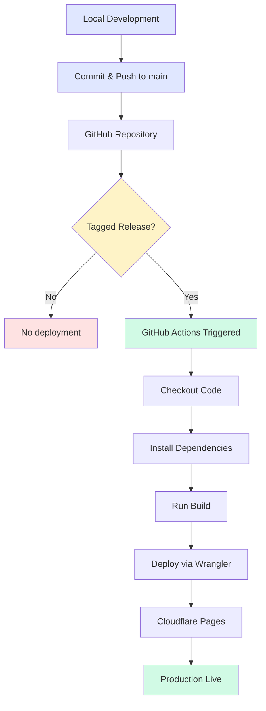

# Versioned Release Deployment Specification

**Status:** 📋 Future
**Priority:** Medium
**Complexity:** Low-Medium
**Last Updated:** 2026-01-01
**Dependencies:** None (one-time infrastructure setup)

---

## Overview

This specification details how to transition from automatic deployment (every push to `main` triggers production) to versioned release deployment (only tagged releases deploy to production).

### Current State (Auto-Deploy)

- **Trigger:** Every push to `main` branch
- **Deploy Method:** Cloudflare Pages automatic GitHub integration
- **Problem:** Documentation updates, WIP code, and experimental changes go live unintentionally
- **Builds Used:** Counted against Cloudflare Pages free tier (500/month)

### Target State (Versioned Releases)

- **Trigger:** Only when version tags are pushed (e.g., `v1.2.0`)
- **Deploy Method:** GitHub Actions + Wrangler CLI
- **Benefits:**
  - Intentional production releases only
  - Freedom to push without breaking live site
  - GitHub releases provide clear deployment history
  - Wrangler deploys don't count against free tier build limit
  - Better control over what users see and when

---

## Problem Statement

As a solo developer maintaining a public-facing site, I need control over what goes to production and when. Currently, every commit I push—whether it's a typo fix in documentation, an experimental feature, or a work-in-progress change—automatically deploys to the live site within minutes.

This creates anxiety around pushing code and limits my ability to use the `main` branch for incremental work without affecting the production experience.

---

## Acceptance Criteria

### Must Have
- [ ] Production deploys only when I explicitly tag a release
- [ ] GitHub Actions workflow builds and deploys on tag push
- [ ] Cloudflare automatic deploys are disabled
- [ ] Clear documentation for the release workflow
- [ ] GitHub releases created alongside tags for changelog tracking

### Nice to Have
- [ ] Automated release notes generation from commit messages
- [ ] Slack/Discord notification when deploy completes
- [ ] Staging environment for pre-release testing
- [ ] Rollback capability to previous tagged version

---

## Architecture

### Flow Diagram



### Components

| Component | Role | Configuration |
|-----------|------|---------------|
| **GitHub Actions** | CI/CD orchestrator | Workflow file in `.github/workflows/deploy.yml` |
| **Wrangler** | Cloudflare CLI deployment tool | Deployed via `cloudflare/wrangler-action@v3` |
| **Cloudflare API Token** | Authentication | Stored in GitHub repository secrets |
| **Version Tags** | Deployment trigger | Semantic versioning format (`vX.Y.Z`) |

### Why This Approach?

**vs. Cloudflare Automatic Deployments:**
- More control: deploys only when intended
- Free tier optimization: Wrangler deploys don't count toward 500 builds/month
- Clear versioning: tags provide deployment history

**vs. Manual Wrangler Deploys:**
- Automated: no need to run commands locally
- Consistent: same build environment every time
- Auditable: GitHub Actions log shows exactly what happened

---

## Implementation Steps

### Step 1: Disable Cloudflare Automatic Deploys

1. Navigate to [Cloudflare Dashboard](https://dash.cloudflare.com/)
2. Go to **Pages** → **[your-project-name]**
3. Click **Settings** → **Builds & deployments**
4. Under **Branch deployments**, click **Pause deployments** or **Disable**
5. Confirm the change

**Why this first?** Prevents both systems from deploying simultaneously during setup.

**Verification:** Push a commit to `main` and confirm Cloudflare does NOT trigger a build.

---

### Step 2: Create Cloudflare API Token

1. Go to [Cloudflare Dashboard](https://dash.cloudflare.com/) → **My Profile** → **API Tokens**
2. Click **Create Token**
3. Use the **Edit Cloudflare Workers** template
4. Configure permissions:
   - **Account** → **Cloudflare Pages** → **Edit**
5. Set **Account Resources**:
   - Include → **All accounts** (or select specific account)
6. Click **Continue to summary** → **Create Token**
7. **Copy the token immediately** (shown only once)

**Security note:** This token has edit access to Cloudflare Pages. Keep it secure. Never commit it to git.

---

### Step 3: Add GitHub Repository Secrets

1. Go to your GitHub repository → **Settings** → **Secrets and variables** → **Actions**
2. Click **New repository secret**
3. Add two secrets:

| Secret Name | Value | Where to Find |
|-------------|-------|---------------|
| `CLOUDFLARE_API_TOKEN` | Token from Step 2 | Copied in previous step |
| `CLOUDFLARE_ACCOUNT_ID` | Your account ID | Cloudflare Dashboard sidebar |

**Finding Account ID:**
- Open Cloudflare Dashboard
- Click any zone/project
- Account ID appears in the right sidebar under **Account ID**
- Format: 32-character alphanumeric string

---

### Step 4: Create GitHub Actions Workflow

Create the file `.github/workflows/deploy.yml`:

```yaml
name: Deploy to Cloudflare Pages

on:
  push:
    tags:
      - 'v*'  # Triggers on version tags like v1.0.0, v1.2.3, v2.0.0-beta.1

jobs:
  deploy:
    runs-on: ubuntu-latest
    name: Build and Deploy to Production

    steps:
      - name: Checkout repository
        uses: actions/checkout@v4
        with:
          fetch-depth: 0  # Full history for git-based versioning

      - name: Setup Node.js
        uses: actions/setup-node@v4
        with:
          node-version: '20'
          cache: 'npm'

      - name: Install dependencies
        run: npm ci

      - name: Build production bundle
        run: npm run build
        env:
          NODE_ENV: production

      - name: Deploy to Cloudflare Pages
        uses: cloudflare/wrangler-action@v3
        with:
          apiToken: ${{ secrets.CLOUDFLARE_API_TOKEN }}
          accountId: ${{ secrets.CLOUDFLARE_ACCOUNT_ID }}
          command: pages deploy dist --project-name=concerts --branch=main
```

**Configuration notes:**

- **`--project-name=concerts`**: Replace `concerts` with your actual Cloudflare Pages project name
- **`--branch=main`**: Tells Cloudflare this is the production branch (affects URL routing)
- **`dist`**: The output directory from `npm run build` (Vite default)

**Commit this file:**
```bash
git add .github/workflows/deploy.yml
git commit -m "chore: Add versioned release deployment workflow"
git push origin main
```

---

## Release Workflow

Once setup is complete, deploying becomes intentional and straightforward.

### Creating a Release

```bash
# 1. Ensure all changes are committed and main is clean
git status  # Should show "nothing to commit, working tree clean"

# 2. Create an annotated version tag
git tag -a v1.2.0 -m "Release v1.2.0: Add dark mode toggle"

# 3. Push the tag to GitHub (this triggers deployment)
git push origin v1.2.0
```

### What Happens Next

1. **GitHub Actions starts** (triggered by tag push)
2. **Build runs** in fresh Ubuntu environment
3. **Wrangler deploys** to Cloudflare Pages
4. **Production updates** within 2-3 minutes
5. **Action logs** show full deploy output

### Monitoring the Deploy

- **GitHub Actions tab**: See real-time progress
  - URL: `https://github.com/[username]/[repo]/actions`
  - Shows checkout → install → build → deploy steps
  - Red X if any step fails
  - Green checkmark when complete

- **Cloudflare Pages dashboard**: See deployment history
  - URL: `https://dash.cloudflare.com/pages/[project]`
  - Lists all deployments with timestamps
  - Shows build logs from Wrangler

### Creating GitHub Releases

While tags trigger deploys, GitHub Releases provide better documentation:

```bash
# Option A: Create release via gh CLI
gh release create v1.2.0 \
  --title "v1.2.0 - Dark Mode Support" \
  --notes "### What's New
- Added dark mode toggle in settings
- Improved contrast in Venues scene
- Fixed tooltip positioning bug

### Technical Details
- 12 commits since v1.1.0
- Updated dependencies: vite, react
- See full diff: https://github.com/user/repo/compare/v1.1.0...v1.2.0"

# Option B: Create release via GitHub web UI
# Navigate to Releases → Draft a new release → Fill in details
```

**Release best practices:**
- Include a summary of user-facing changes
- Reference related issues or pull requests
- Attach build artifacts if relevant (e.g., source code ZIP)
- Use consistent formatting across releases

---

## Semantic Versioning

Use [Semantic Versioning](https://semver.org/) for tag names:

| Version Format | When to Use | Example |
|----------------|-------------|---------|
| `v1.0.0` | First public release | `v1.0.0` |
| `vX.Y.Z` | Standard release | `v1.2.3` |
| `vX.Y.0` | Minor version with new features | `v1.3.0` |
| `vX.0.0` | Major version with breaking changes | `v2.0.0` |
| `vX.Y.Z-beta.N` | Pre-release testing | `v1.4.0-beta.1` |

**Version component meanings:**
- **Major (X):** Breaking changes, major redesigns
- **Minor (Y):** New features, backward-compatible
- **Patch (Z):** Bug fixes, minor tweaks

---

## Rollback Strategy

If a deployment introduces a critical bug, you have options:

### Option 1: Quick Revert (Fastest)

Cloudflare Pages keeps deployment history. Roll back via dashboard:

1. Go to Cloudflare Pages → [project] → **Deployments**
2. Find the last known-good deployment
3. Click **⋯** (three dots) → **Rollback to this deployment**
4. Confirm

**Downside:** Doesn't update git tags or GitHub releases to reflect rollback.

### Option 2: Revert Tag (Cleanest)

Create a new release that reverts to previous code:

```bash
# 1. Create new branch from last known-good tag
git checkout -b revert-to-v1.1.0 v1.1.0

# 2. Create new tag for the reverted version
git tag -a v1.2.1 -m "Revert to v1.1.0 due to critical bug in v1.2.0"

# 3. Push tag (triggers deploy)
git push origin v1.2.1
```

**Advantage:** Git history accurately reflects what's in production.

### Option 3: Hotfix Tag (Best for Bugs)

Fix the bug in a new commit and release immediately:

```bash
# 1. Fix the bug on main
git checkout main
# ... make changes ...
git commit -m "fix: Critical tooltip positioning bug"

# 2. Create hotfix tag
git tag -a v1.2.1 -m "Hotfix: Resolve tooltip positioning bug"

# 3. Push tag
git push origin v1.2.1
```

---

## Troubleshooting

### Deploy Fails: "Authentication Failed"

**Symptom:** GitHub Action shows error: `Authentication failed`

**Cause:** Invalid or expired Cloudflare API token

**Fix:**
1. Generate new token in Cloudflare Dashboard
2. Update `CLOUDFLARE_API_TOKEN` secret in GitHub repository settings
3. Re-run the failed workflow (GitHub Actions → select run → **Re-run all jobs**)

---

### Deploy Fails: "Project not found"

**Symptom:** GitHub Action shows error: `Project 'concerts' not found`

**Cause:** Project name mismatch in `wrangler-action` command

**Fix:**
1. Check actual project name in Cloudflare Pages dashboard
2. Update `--project-name=` in `.github/workflows/deploy.yml`
3. Commit and push the fix
4. Retag and push: `git tag -f v1.2.0 && git push origin v1.2.0 --force`

---

### Deploy Succeeds but Site Shows Old Version

**Symptom:** Deployment completes successfully, but visiting the site shows old content

**Cause:** Browser caching or Cloudflare CDN cache

**Fix:**
1. **Hard refresh browser:** Ctrl+Shift+R (Windows/Linux) or Cmd+Shift+R (Mac)
2. **Clear Cloudflare cache:** Dashboard → Caching → **Purge Everything**
3. **Wait 5 minutes:** CDN propagation takes time across global edge network

For Open Graph images specifically, use [Facebook's Sharing Debugger](https://developers.facebook.com/tools/debug/) to force cache refresh.

---

### Build Fails: TypeScript Errors

**Symptom:** GitHub Action fails at `npm run build` step with TypeScript errors

**Cause:** Type errors that passed locally but fail in CI (e.g., due to different dependencies)

**Fix:**
1. Run `npm run build` locally to reproduce
2. Fix type errors
3. Commit and push fixes
4. Retag release: `git tag -f v1.2.0 && git push origin v1.2.0 --force`

**Prevention:** Always run `npm run build` locally before tagging a release.

---

### Accidentally Pushed Wrong Tag

**Symptom:** Tagged `v1.3.0` but meant `v1.2.1`

**Fix:**
```bash
# Delete tag locally
git tag -d v1.3.0

# Delete tag on GitHub
git push origin :refs/tags/v1.3.0

# Create correct tag
git tag -a v1.2.1 -m "Correct release version"
git push origin v1.2.1
```

**Note:** If the wrong tag already triggered a deploy, you may need to rollback or deploy the correct version.

---

## Testing the Setup

Before relying on this workflow for production releases, test it:

### Test Deploy to Staging (Optional)

If you want to test without affecting production:

1. Create a separate Cloudflare Pages project (e.g., `concerts-staging`)
2. Duplicate the workflow as `.github/workflows/deploy-staging.yml`
3. Modify trigger to use branch instead of tag:
   ```yaml
   on:
     push:
       branches:
         - staging
   ```
4. Push to `staging` branch to verify workflow works

### Dry Run Test (Recommended)

1. Create a test tag: `git tag -a v0.0.1-test -m "Test deployment workflow"`
2. Push tag: `git push origin v0.0.1-test`
3. Watch GitHub Actions tab for workflow execution
4. Verify site updates at your production URL
5. Verify Cloudflare Pages dashboard shows new deployment
6. Delete test tag when done: `git tag -d v0.0.1-test && git push origin :refs/tags/v0.0.1-test`

---

## Migration Checklist

Use this checklist when implementing versioned releases:

### Pre-Migration
- [ ] Read through this entire specification
- [ ] Understand current deployment method (Cloudflare auto-deploy)
- [ ] Identify Cloudflare project name
- [ ] Verify current site is working as expected

### Setup
- [ ] Disable Cloudflare automatic deployments (Step 1)
- [ ] Create Cloudflare API token (Step 2)
- [ ] Add GitHub repository secrets (Step 3)
- [ ] Create `.github/workflows/deploy.yml` (Step 4)
- [ ] Commit and push workflow file

### Testing
- [ ] Create test tag (`v0.0.1-test`)
- [ ] Push tag to GitHub
- [ ] Verify GitHub Action runs successfully
- [ ] Verify site updates in production
- [ ] Check Cloudflare Pages dashboard for deployment
- [ ] Delete test tag

### Rollback Plan
- [ ] Document how to revert to Cloudflare auto-deploy if needed
- [ ] Save API token securely (e.g., password manager)
- [ ] Test rollback procedure in Cloudflare dashboard

### First Real Release
- [ ] Create release tag (e.g., `v1.1.0`)
- [ ] Push tag to GitHub
- [ ] Monitor deployment in GitHub Actions
- [ ] Verify production site updates
- [ ] Create GitHub Release with notes
- [ ] Update project documentation (STATUS.md, WORKFLOW.md)

---

## Related Documentation

- **[WORKFLOW.md](../../WORKFLOW.md)** — Current state deployment workflow (Phase 5)
- **[BUILD.md](../../BUILD.md)** — Build pipeline and OG image generation
- **[Cloudflare Pages Docs](https://developers.cloudflare.com/pages/)** — Official Cloudflare Pages documentation
- **[Wrangler CLI Docs](https://developers.cloudflare.com/workers/wrangler/)** — Wrangler command reference
- **[GitHub Actions Docs](https://docs.github.com/en/actions)** — GitHub Actions workflow syntax

---

## Future Enhancements

Once versioned releases are working, consider:

### Automated Release Notes
Use a GitHub Action to auto-generate release notes from commit messages:
- **Tool:** [release-drafter](https://github.com/release-drafter/release-drafter)
- **Benefit:** Consistent release documentation with minimal effort

### Deployment Notifications
Get notified when deploys complete:
- **Slack integration:** Post to channel when deployment succeeds/fails
- **Discord webhook:** Notify dev channel with release notes
- **Email:** GitHub Actions can send emails on workflow completion

### Staging Environment
Test releases before production:
- **Cloudflare Pages branch deploys:** Create `staging` branch → separate Pages project
- **Dual workflow:** `deploy-staging.yml` (branch trigger) + `deploy-production.yml` (tag trigger)
- **Benefit:** Catch issues before they affect production users

### Deployment Approval Gate
Require manual approval before deploy:
- **GitHub Environments:** Create `production` environment with protection rules
- **Approval required:** Designated users must approve before deploy runs
- **Benefit:** Extra safety for critical releases

---

## Summary

This specification provides a complete path from automatic deployments to versioned release deployments, offering:

- **Control:** Deploy only when you intend to
- **Freedom:** Push to `main` without affecting production
- **History:** Git tags and GitHub Releases document what changed and when
- **Efficiency:** Wrangler deploys don't count against Cloudflare's free tier build limit

**Estimated implementation time:** 1-2 hours (mostly one-time setup)
**Maintenance:** Minimal (workflow runs automatically once configured)

---

*Last updated: January 2026*
